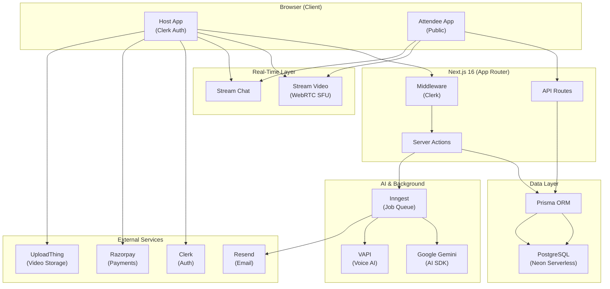
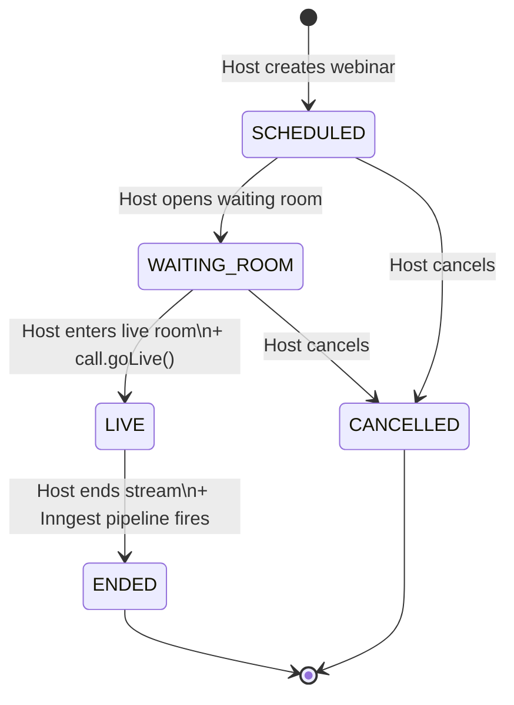
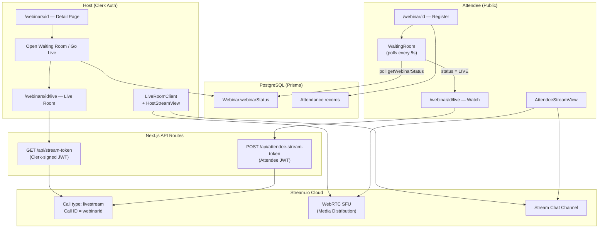
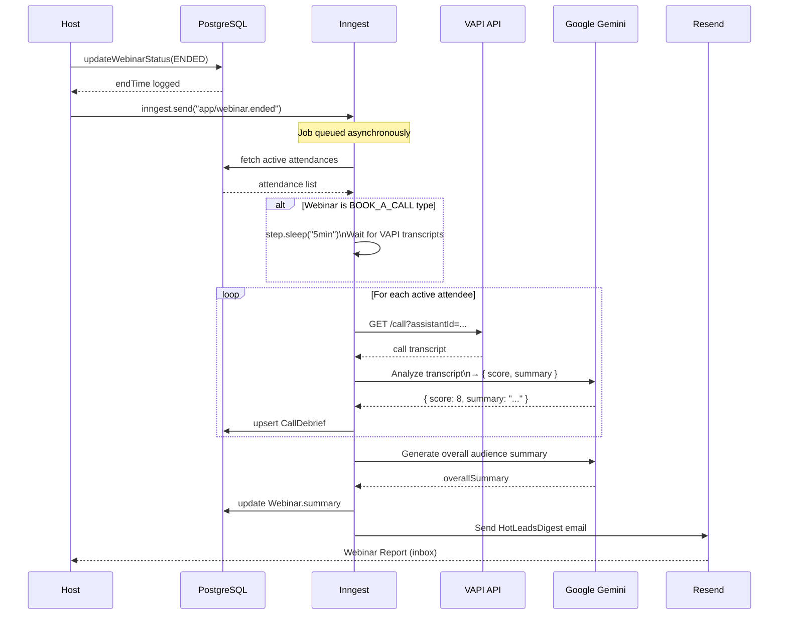
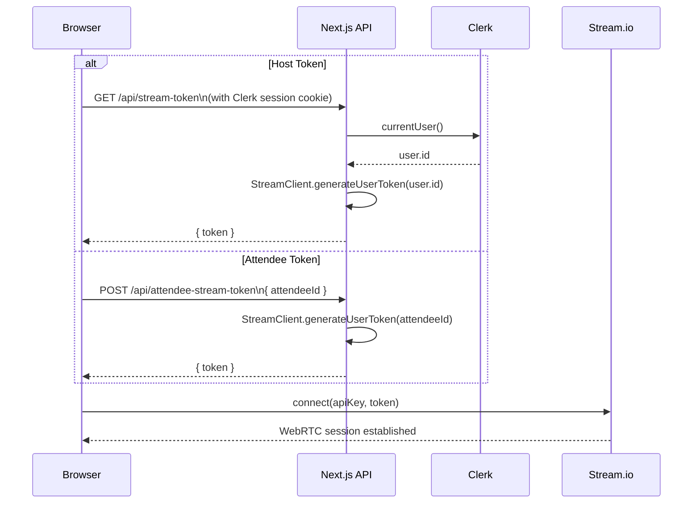
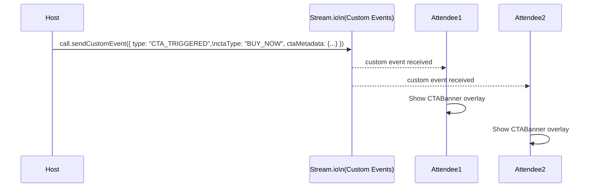
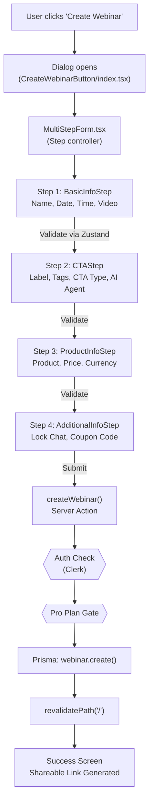
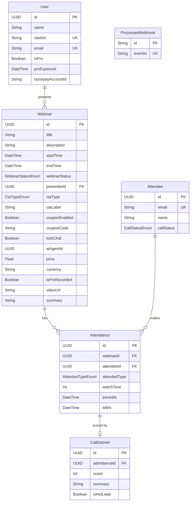

# Spotlight — AI-Powered Webinar Platform

<div align="center">


**A full-stack, production-ready webinar platform with live streaming, AI-powered lead scoring, real-time chat, CTA banners, and automated post-webinar email reports.**

[Features](#-features) • [Architecture](#-architecture) • [Tech Stack](#-tech-stack) • [Getting Started](#-getting-started) • [Environment Variables](#-environment-variables) • [Database Schema](#-database-schema) • [API Reference](#-api-reference) • [Deployment](#-deployment)

</div>

---

## Overview

Spotlight is a SaaS webinar platform that enables hosts to run live (or pre-recorded) webinars, engage audiences with real-time chat and interactive CTAs, and automatically process attendee leads using AI after the session ends. The platform integrates a full WebRTC live streaming stack, a voice AI breakout room, a payments layer, and a background processing pipeline — all built on Next.js 16 with App Router.

---

## Features

### For Hosts
- **4-step guided webinar creation** with a multi-step wizard (Zustand + Framer Motion)
- **Live streaming** via Stream.io's WebRTC SFU infrastructure (no DIY signaling)
- **Pre-recorded mode** — upload a video via UploadThing and run a simulated live session
- **OBS / RTMP ingress** — broadcast from OBS Studio instead of browser camera
- **Screen sharing** built into the live room
- **Interactive CTA banners** sent in real-time to all attendees (`BUY_NOW` or `BOOK_A_CALL`)
- **Live chat** with optional lock/unlock control
- **Waiting room management** — open standby mode before going live
- **AI-powered post-webinar email report** (Hot Leads Digest) with lead scores and VAPI call summaries

### For Attendees
- **Public registration** without requiring a user account
- **Smart waiting room** that auto-redirects when the host goes live (5s polling)
- **Real-time video playback** as a viewer-only participant
- **Live chat** during the session
- **CTA overlays** — triggered by the host, shown as banners in real-time
- **VAPI AI breakout room** — 1-on-1 voice call with an AI sales agent after clicking "Book a Call"

### AI & Automation
- **Gemini 3.1 Flash Lite** analyzes VAPI call transcripts per attendee
- **Rules-based + AI lead scoring** (scores 1–10) for every active attendee
- **Webinar-level AI summary** generated from all individual score summaries
- **Automated email dispatch** via Resend (React Email templates)
- **Inngest background pipeline** handles all post-webinar processing without timeout constraints

### Payments
- **Razorpay integration** for Pro plan subscriptions
- **Coupon code system** configurable per webinar
- **Pro pass gating** — only Pro users can create webinars

---

## Architecture

### System Overview



---

### Webinar Lifecycle (State Machine)



---

### Live Streaming Architecture



> **Key insight:** `webinarId` (UUID in PostgreSQL) **is also** the Stream **call ID**. One webinar = one `livestream` call in Stream.io.

---

### Post-Webinar AI Pipeline (Inngest)



---

### Token Authentication Flow



---

### CTA Real-Time Event Flow



---

### Webinar Creation Flow



---

## Tech Stack

| Layer | Technology | Purpose |
|-------|------------|---------|
| **Framework** | Next.js 16.2 (App Router) | Full-stack React, Server Actions, API Routes |
| **Language** | TypeScript 5 | End-to-end type safety |
| **Auth** | Clerk | Authentication, session management |
| **Database** | PostgreSQL via Neon (Serverless) | Primary data store |
| **ORM** | Prisma 7.8 | Type-safe DB queries, migrations |
| **Styling** | Tailwind CSS 4 + shadcn/ui | UI component library |
| **Animations** | Framer Motion | Step transitions, micro-animations |
| **Live Video** | Stream.io Video SDK | WebRTC SFU, livestream call management |
| **Live Chat** | Stream Chat SDK | Real-time text messaging |
| **Voice AI** | VAPI | AI-powered 1-on-1 voice breakout rooms |
| **AI Models** | Google Gemini 3.1 Flash Lite | Transcript analysis, lead scoring, summaries |
| **AI SDK** | Vercel AI SDK (`ai`) | Structured object generation from LLMs |
| **Background Jobs** | Inngest | Durable, retryable post-webinar pipeline |
| **Email** | Resend + React Email | Transactional HTML emails as React components |
| **Payments** | Razorpay | Pro plan subscriptions |
| **File Uploads** | UploadThing | Pre-recorded video hosting |
| **State Management** | Zustand | Global webinar creation form state |
| **Validation** | Zod | Schema validation (AI outputs + forms) |

---

## Project Structure

```
webinaar-platform/
├── prisma/
│   ├── schema.prisma           # Database models & enums
│   └── migrations/             # DB migration history
│
├── src/
│   ├── app/
│   │   ├── (auth)/             # Sign-in / Sign-up pages (Clerk)
│   │   ├── (protectedRoutes)/  # Host-only routes
│   │   │   ├── webinars/
│   │   │   │   ├── page.tsx                     # /webinars dashboard
│   │   │   │   └── [webinarid]/
│   │   │   │       ├── page.tsx                 # Webinar detail + status controls
│   │   │   │       └── live/
│   │   │   │           └── page.tsx             # Host live room
│   │   │   └── callback/                        # Auth callback handler
│   │   │
│   │   ├── webinar/            # Public attendee routes
│   │   │   └── [webinarid]/
│   │   │       ├── page.tsx                     # Registration + Waiting Room
│   │   │       ├── live/page.tsx                # Attendee live view
│   │   │       └── call/page.tsx                # VAPI AI breakout room
│   │   │
│   │   ├── api/
│   │   │   ├── stream-token/   # Host Stream JWT
│   │   │   ├── attendee-stream-token/  # Attendee Stream JWT
│   │   │   ├── inngest/        # Inngest webhook handler
│   │   │   ├── razorpay/       # Payment webhooks + order creation
│   │   │   └── uploadthing/    # UploadThing file router
│   │   │
│   │   ├── globals.css
│   │   ├── layout.tsx          # Root layout (Clerk + Providers)
│   │   └── page.tsx            # Landing page
│   │
│   ├── actions/                # Next.js Server Actions ("use server")
│   │   ├── auth.ts             # onAuthenticateUser (Clerk → DB User)
│   │   ├── webinar.ts          # createWebinar, updateWebinarStatus, getWebinarStatus
│   │   ├── attendence.ts       # registerAttendee, updateAttendanceStatus
│   │   └── vapi.ts             # getVapiAssistants
│   │
│   ├── components/
│   │   ├── ui/                 # shadcn/ui base components
│   │   └── ui/ReusableComponent/
│   │       └── CreateWebinarButton/
│   │           ├── index.tsx           # Dialog shell + success screen
│   │           ├── MultiStepForm.tsx   # Step controller + submit logic
│   │           ├── BasicInfoStep.tsx   # Step 1
│   │           ├── CTAStep.tsx         # Step 2
│   │           ├── ProductInfoStep.tsx # Step 3
│   │           └── AdditionalInfoStep.tsx # Step 4
│   │
│   ├── inngest/
│   │   ├── client.ts           # Inngest client instance
│   │   └── functions.ts        # processWebinarEnd (the AI pipeline)
│   │
│   ├── emails/
│   │   └── HotLeadsDigest.tsx  # React Email template for post-webinar report
│   │
│   ├── lib/
│   │   ├── prismaClient.ts     # Singleton Prisma client (Neon adapter)
│   │   └── type.ts             # Form validation logic (per step)
│   │
│   ├── store/
│   │   └── useWebinarStore.ts  # Zustand global store for webinar creation
│   │
│   └── providers/
│       └── index.tsx           # ThemeProvider, Toaster wrappers
│
├── public/                     # Static assets
├── .env                        # Environment variables (see below)
├── next.config.ts
├── prisma.config.ts
└── package.json
```

---

## Database Schema



### Enums

| Enum | Values |
|------|--------|
| `WebinarStatusEnum` | `SCHEDULED`, `WAITING_ROOM`, `LIVE`, `ENDED`, `CANCELLED` |
| `CtaTypeEnum` | `BUY_NOW`, `BOOK_A_CALL` |
| `AttendedTypeEnum` | `REGISTERED`, `ATTENDED`, `ADDED_TO_CART`, `FOLLOW_UP`, `BREAKOUT_ROOM`, `CONVERTED` |
| `CallStatusEnum` | `PENDING`, `InProgress`, `COMPLETED` |

---

## Getting Started

### Prerequisites

- Node.js `>= 18`
- PostgreSQL database (recommended: [Neon](https://neon.tech/) for serverless)
- Accounts for: [Clerk](https://clerk.dev), [Stream.io](https://getstream.io), [VAPI](https://vapi.ai), [Inngest](https://inngest.com), [Resend](https://resend.com), [Razorpay](https://razorpay.com), [UploadThing](https://uploadthing.com)

### Installation

```bash
# 1. Clone the repository
git clone https://github.com/your-username/webinaar-platform.git
cd webinaar-platform

# 2. Install dependencies (also runs prisma generate via postinstall)
npm install

# 3. Copy and fill environment variables
cp .env.example .env
# Edit .env with your credentials

# 4. Run database migrations
npx prisma migrate deploy

# 5. Start the Inngest dev server (in a separate terminal)
npx inngest-cli@latest dev

# 6. Start the Next.js dev server
npm run dev
```

The app will be available at `http://localhost:3000`.

---

## Environment Variables

Create a `.env` file in the root directory with the following keys:

```env
# ─── Database ────────────────────────────────────────────────────────────────
DATABASE_URL="postgresql://..."           # Neon / any PostgreSQL connection string

# ─── Application ─────────────────────────────────────────────────────────────
NEXT_PUBLIC_BASE_URL=http://localhost:3000

# ─── Clerk (Authentication) ──────────────────────────────────────────────────
NEXT_PUBLIC_CLERK_PUBLISHABLE_KEY=pk_...
CLERK_SECRET_KEY=sk_...
NEXT_PUBLIC_CLERK_SIGN_IN_URL=/sign-in
NEXT_PUBLIC_CLERK_SIGN_UP_URL=/sign-up
NEXT_PUBLIC_CLERK_AFTER_SIGN_IN_URL=/callback
NEXT_PUBLIC_CLERK_AFTER_SIGN_UP_URL=/callback

# ─── Stream.io (Live Video + Chat) ────────────────────────────────────────────
NEXT_PUBLIC_STREAM_API_KEY=...           # Public (used browser-side)
STREAM_SECRET_KEY=...                    # Secret (server-only, never expose)

# ─── VAPI (Voice AI) ─────────────────────────────────────────────────────────
VAPI_API_KEY=...                         # Server-side VAPI calls
NEXT_PUBLIC_VAPI_PUBLIC_KEY=...          # Browser-side VAPI SDK

# ─── Razorpay (Payments) ─────────────────────────────────────────────────────
NEXT_PUBLIC_RAZORPAY_KEY_ID=rzp_...
RAZORPAY_KEY_ID=rzp_...
RAZORPAY_KEY_SECRET=...
RAZORPAY_WEBHOOK_SECRET=...              # Set this in Razorpay dashboard too

# ─── Resend (Email) ──────────────────────────────────────────────────────────
RESEND_API_KEY=re_...

# ─── Google Gemini (AI) ──────────────────────────────────────────────────────
GOOGLE_GENERATIVE_AI_API_KEY=...

# ─── Inngest (Background Jobs) ───────────────────────────────────────────────
INNGEST_EVENT_KEY=local                  # Use "local" for development
INNGEST_DEV=1                            # Remove in production
INNGEST_BASE_URL=http://localhost:8288   # Remove in production

# ─── UploadThing (Video Uploads) ─────────────────────────────────────────────
UPLOADTHING_TOKEN=...
UPLOADTHING_SECRET=...
```

> **Never commit `.env` to version control.** Add it to `.gitignore`.

---

## API Reference

### Stream Token Endpoints

| Endpoint | Method | Auth | Description |
|----------|--------|------|-------------|
| `/api/stream-token` | `GET` | Clerk session | Returns a signed Stream JWT for the authenticated host |
| `/api/attendee-stream-token` | `POST` | None (public) | Returns a signed Stream JWT for an attendee given `{ attendeeId }` |

### Inngest Webhook

| Endpoint | Method | Description |
|----------|--------|-------------|
| `/api/inngest` | `GET, POST, PUT` | Inngest cloud communication endpoint |

### Razorpay

| Endpoint | Method | Description |
|----------|--------|-------------|
| `/api/razorpay/create-order` | `POST` | Creates a Razorpay order for Pro subscription |
| `/api/razorpay/webhook` | `POST` | Handles payment confirmation webhook (idempotent) |

### UploadThing

| Endpoint | Method | Description |
|----------|--------|-------------|
| `/api/uploadthing` | `GET, POST` | File router for pre-recorded video uploads |

---

## Key Flows Explained

### 1. Webinar Lifecycle

| Action | DB Status | Stream Call Exists? | Attendees See Video? |
|--------|-----------|---------------------|----------------------|
| Webinar Created | `SCHEDULED` | No | Registration + countdown |
| Host Opens Waiting Room | `WAITING_ROOM` | No | Standby UI (polling) |
| Host Enters Live Room | `LIVE` (auto) | Yes | Yes, after host `goLive()` |
| Host Clicks End Stream | `ENDED` | Disconnected | Session ended screen |

### 2. Lead Scoring System

After a webinar ends, each active attendee gets a score (1–10):

| Score | Condition |
|-------|-----------|
| **10** | Converted (payment verified) |
| **8** | Cart abandoned (clicked BUY_NOW but didn't pay) |
| **8** | Clicked BOOK_A_CALL CTA but didn't join breakout |
| **5** | Stayed ≥ 70% of the webinar duration |
| **AI-scored** | Joined VAPI breakout room (Gemini analyzes transcript) |
| **2** | Left early, no significant action |

### 3. Two-Channel Real-Time Architecture

| Channel | Technology | Purpose |
|---------|-----------|---------|
| **Video/Audio** | Stream Video SDK (`livestream` call) | Host broadcast → viewer playback |
| **Text Chat** | Stream Chat SDK (`livestream` channel) | Bidirectional messaging |
| **CTA Events** | Stream custom events on the call | Instant banner delivery to all attendees |
| **Voice AI** | VAPI + Daily.co (separate from Stream) | 1-on-1 AI sales calls in `/webinar/[id]/call` |

---

## Troubleshooting

| Symptom | Likely Cause | Fix |
|---------|-------------|-----|
| Attendee: "Call not found" | Host hasn't entered `/webinars/{id}/live` yet | Retry logic handles this automatically (5 retries) |
| Attendee: "Failed to get stream token" | Missing env vars | Check `NEXT_PUBLIC_STREAM_API_KEY` and `STREAM_SECRET_KEY` |
| Host: 401 on `/api/stream-token` | Not signed in to Clerk | Sign in first |
| Video works, chat doesn't | Chat client init failed separately | Check `HostChatPanel` / `AttendeeChatPanel` console errors |
| CTA doesn't appear on attendee side | `call.on("custom")` not registered | Check attendee `useEffect` depending on `call` object |
| DB shows `LIVE` but no video | Host left tab without ending properly | `updateWebinarStatus(ENDED)` and re-open the live room |
| Inngest function not triggering | `INNGEST_DEV=1` not set / Inngest dev server not running | Run `npx inngest-cli dev` in a terminal |
| Post-webinar email not received | Resend API key invalid or Inngest pipeline errored | Check Inngest dashboard for function logs |

---

## Deployment

### Recommended: Vercel

```bash
# Install Vercel CLI
npm i -g vercel

# Deploy
vercel --prod
```

**Important production notes:**
1. Remove `INNGEST_DEV=1` and `INNGEST_BASE_URL` from production env vars
2. Set `INNGEST_EVENT_KEY` to a production key from the [Inngest dashboard](https://app.inngest.com)
3. Register your production Inngest endpoint: `https://your-domain.com/api/inngest`
4. Set `NEXT_PUBLIC_BASE_URL` to your production domain
5. Update Clerk's allowed redirect URLs in the Clerk dashboard
6. Update Razorpay webhook URL to `https://your-domain.com/api/razorpay/webhook`

### Database Migrations in Production

```bash
npx prisma migrate deploy
```

---

## Scripts

| Script | Command | Description |
|--------|---------|-------------|
| Dev server | `npm run dev` | Starts Next.js dev server on port 3000 |
| Build | `npm run build` | Builds the production bundle |
| Start | `npm run start` | Starts the production server |
| Lint | `npm run lint` | Runs ESLint |
| DB Client | `npx prisma studio` | Opens Prisma Studio (DB GUI) |
| DB Migrate | `npx prisma migrate dev` | Runs migrations in development |
| Inngest Dev | `npx inngest-cli dev` | Starts local Inngest dev server on port 8288 |

---

## Contributing

1. Fork the repository
2. Create a feature branch: `git checkout -b feature/my-feature`
3. Commit your changes: `git commit -m "feat: add my feature"`
4. Push the branch: `git push origin feature/my-feature`
5. Open a Pull Request

Please follow the existing code style (TypeScript strict mode, Server Actions for mutations, Prisma for all DB access).

---

## License

This project is private and proprietary.

---

<div align="center">
Built with Next.js, Stream.io, VAPI, Google Gemini, and Inngest.
</div>
