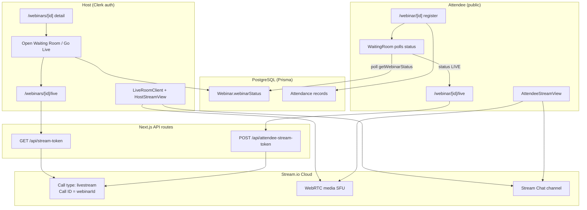
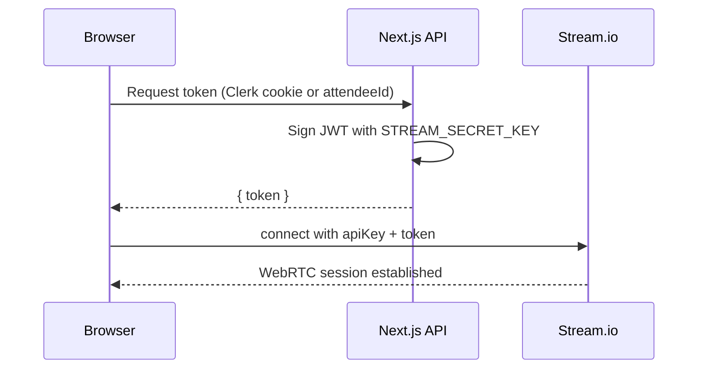
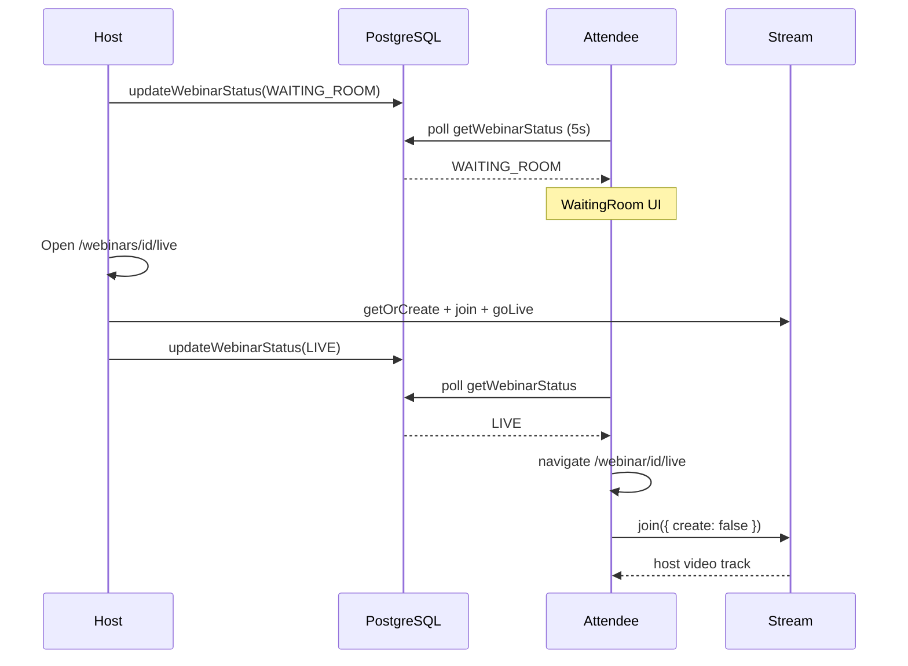
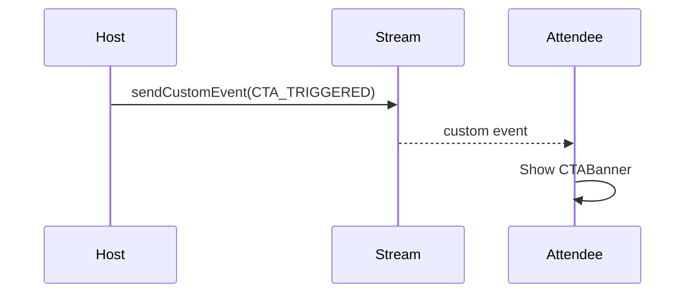

# Spotlight — Live Streaming Architecture (A–Z)

This document explains **how live streaming works in this project**: theory, system design, data flow, and every important code file. It is written for someone with **no prior streaming background**.

---

## Table of contents

1. [Big picture](#1-big-picture)
2. [Theory you need](#2-theory-you-need)
3. [Webinar lifecycle (database state machine)](#3-webinar-lifecycle-database-state-machine)
4. [Waiting room — how it works](#4-waiting-room--how-it-works)
5. [Host live flow (protected)](#5-host-live-flow-protected)
6. [Attendee live flow (public)](#6-attendee-live-flow-public)
7. [Stream.io integration](#7-streamio-integration)
8. [Authentication & tokens](#8-authentication--tokens)
9. [WebRTC under the hood (what Stream does for you)](#9-webrtc-under-the-hood-what-stream-does-for-you)
10. [Chat (separate from video)](#10-chat-separate-from-video)
11. [CTAs over real-time events](#11-ctas-over-real-time-events)
12. [OBS / RTMP ingress](#12-obs--rtmp-ingress)
13. [Pre-recorded mode](#13-pre-recorded-mode)
14. [File map (every streaming-related file)](#14-file-map-every-streaming-related-file)
15. [Environment variables](#15-environment-variables)
16. [Sequence diagrams](#16-sequence-diagrams)
17. [Common failures & debugging](#17-common-failures--debugging)
18. [What is NOT in this stack](#18-what-is-not-in-this-stack)

---

## 1. Big picture

Spotlight does **not** implement raw WebRTC signaling yourself. It uses **[Stream Video](https://getstream.io/video/)** (SDK + cloud) for:

- Host camera/mic (and screen share)
- One-to-many **livestream** delivery to attendees
- **Custom events** (CTA banners)
- Optional **RTMP ingest** (OBS)

**Your app** owns:

- **Business state** in PostgreSQL (`webinarStatus`: SCHEDULED → WAITING_ROOM → LIVE → ENDED)
- **Who is host vs attendee** (Clerk vs public registration)
- **Signed tokens** so only allowed users join a Stream call
- **Polling** so attendees know when to leave the waiting room



**Key idea:** `webinarId` (UUID in your DB) **is also** the Stream **call ID**. One webinar = one `livestream` call in Stream.

---

## 2. Theory you need

### 2.1 What is live streaming here?

- **Host** publishes audio/video (WebRTC) to Stream.
- **Stream** distributes that stream to many **viewers** (attendees) with low latency.
- Attendees are mostly **watch-only** (they join the call but do not broadcast by default).

This is closer to **YouTube Live / webinar** than a **Zoom meeting where everyone has a camera**.

### 2.2 WebRTC in one paragraph

**WebRTC** is the browser standard for real-time audio/video. It needs:

1. **Media capture** — `getUserMedia()` (camera/mic)
2. **Signaling** — exchange SDP/ICE candidates (who connects to whom)
3. **Media transport** — often via **SFU** (Selective Forwarding Unit): server receives host tracks and forwards to viewers

**You do not write steps 2–3.** `@stream-io/video-react-sdk` + Stream cloud do that when you `call.join()` and `call.goLive()`.

### 2.3 Why Stream instead of DIY WebRTC?

| DIY WebRTC | Stream in this project |
|------------|-------------------------|
| Build signaling server, TURN/STUN, scaling | Managed infrastructure |
| One peer connection per viewer (doesn't scale) | SFU livestream mode |
| Build chat separately | Stream Chat SDK reuses same API key |
| Build RTMP ingest | `ingress.rtmp` on call state (OBS panel) |

### 2.4 Two “real-time” channels in this app

| Channel | Technology | Purpose |
|---------|------------|---------|
| **Video/audio** | Stream **Video** SDK (`livestream` call) | Host broadcast + attendee player |
| **Text chat** | Stream **Chat** SDK (`livestream` channel) | Host ↔ attendee messages |
| **CTA banners** | Stream Video **custom events** on the same call | Host button → all clients get event |

Vapi AI breakout uses **Daily.co via Vapi** — completely separate from Stream. See `VapiCallRoom.tsx` and `/webinar/[id]/call`.

---

## 3. Webinar lifecycle (database state machine)

Defined in `prisma/schema.prisma`:

```prisma
enum WebinarStatusEnum {
  SCHEDULED
  WAITING_ROOM
  LIVE
  ENDED
  CANCELLED
}
```

### State meanings

| Status | Meaning for host | Meaning for attendee |
|--------|------------------|----------------------|
| `SCHEDULED` | Webinar created; not accepting “standby” yet | Register; see countdown; not in waiting room UI |
| `WAITING_ROOM` | Host opened room; attendees can wait | `WaitingRoom` UI: “Standby Mode” |
| `LIVE` | Broadcast active (or host should be in live room) | Redirect/join `/webinar/[id]/live` |
| `ENDED` | Finished | “Webinar Concluded” |
| `CANCELLED` | Host cancelled | — |

### Who changes status?

**Primary server action:** `updateWebinarStatus` in `src/actions/webinar.ts`

```189:236:src/actions/webinar.ts
export const updateWebinarStatus = async (
  webinarId: string,
  status: WebinarStatusEnum
) => {
  // ... auth check ...
  await prismaClient.webinar.update({
    where: { id: webinarId },
    data: { webinarStatus: status, endTime?: ... },
  });
  // On ENDED: triggers Inngest event app/webinar.ended
};
```

**Host UI buttons:** `WebinarStatusControls.tsx`

| Button | Transition |
|--------|------------|
| Open Waiting Room | `SCHEDULED` → `WAITING_ROOM` |
| Go Live | `WAITING_ROOM` → `LIVE` (+ opens `/webinars/[id]/live` in new tab) |
| End Webinar (detail page) | `LIVE` → `ENDED` |
| End Stream (in live room) | `call.stopLive()` + `ENDED` via `HostStreamView` |

**Important nuance:** When the host enters the live room, `HostStreamView` also calls `call.goLive()` and `updateWebinarStatus(..., LIVE)` automatically after camera/mic enable. So **Stream “live”** and **DB `LIVE`** are aligned when the host uses the live page — not only when clicking “Go Live” on the detail page.

---

## 4. Waiting room — how it works

The waiting room is **not** a separate Stream room. It is:

1. A **UI state** on the public landing page
2. Driven by **`webinarStatus` in PostgreSQL**
3. Kept in sync via **polling** (no WebSockets for status)

### 4.1 Attendee journey

```
/webinar/[webinarId]
  → RegistrationForm (if not registered)
  → WaitingRoom (if registered && status is WAITING_ROOM or SCHEDULED)
  → /webinar/[webinarId]/live (when status becomes LIVE)
```

**Landing orchestration:** `src/app/webinar/[webinarid]/_components/LandingPageClient.tsx`

- Stores `attendeeId` in `localStorage` key `spotlight_attendee_${webinarId}`
- Polls `getWebinarStatus` every **10s** (reschedule + status)
- If already registered and status is `LIVE` → auto-redirect to live page

**Waiting room component:** `src/app/webinar/[webinarid]/_components/WaitingRoom.tsx`

```24:43:src/app/webinar/[webinarid]/_components/WaitingRoom.tsx
  useEffect(() => {
    const interval = setInterval(async () => {
      const data = await getWebinarStatus(webinarId);
      if (data) {
        setStatus(data.status);
        // ... update startTime if rescheduled ...
        if (data.status === WebinarStatusEnum.LIVE) {
          clearInterval(interval);
          setTimeout(() => onLiveRef.current(), 2000);
        }
      }
    }, 5000);
    return () => clearInterval(interval);
  }, [webinarId, webinarStartTime]);
```

- Poll every **5 seconds**
- When status flips to `LIVE`, wait **2 seconds**, then `onLive()` → `router.push(/webinar/.../live)`

### 4.2 Host opens waiting room

On `/webinars/[webinarId]` (protected), host clicks **Open Waiting Room**:

```157:168:src/app/(protectedRoutes)/webinars/[webinarid]/_components/WebinarStatusControls.tsx
          <button
            onClick={() => handleStatusChange(WebinarStatusEnum.WAITING_ROOM)}
          >
            Open Waiting Room
          </button>
```

This **only updates the database**. No Stream call is created yet. Attendees see “Standby Mode” because `getWebinarStatus` returns `WAITING_ROOM`.

### 4.3 “Open Waiting Room” vs “Go Live” vs Stream `goLive()`

| Action | DB status | Stream call exists? | Attendees see video? |
|--------|-----------|---------------------|----------------------|
| Open Waiting Room | `WAITING_ROOM` | Usually **no** | No — waiting UI only |
| Go Live (detail button) | `LIVE` | Host should open `/live` | Only after host joins + `goLive()` |
| Host in live room | `LIVE` (auto) | **yes** `getOrCreate` + `join` + `goLive()` | Yes |

Attendees joining `/webinar/.../live` before the host creates the call will see **“Call not found”** with retry logic (see §6).

---

## 5. Host live flow (protected)

### 5.1 Route & access control

**File:** `src/app/(protectedRoutes)/webinars/[webinarid]/live/page.tsx`

- Requires Clerk auth (`onAuthenticateUser`)
- Only `webinar.presenterId === user.id` may enter
- Renders `LiveRoomClient` full-screen

### 5.2 LiveRoomClient — connect to Stream

**File:** `src/app/(protectedRoutes)/webinars/[webinarid]/live/_components/LiveRoomClient.tsx`

Step-by-step:

1. **Fetch token** — `GET /api/stream-token` (Clerk user id)
2. **Create client** — `new StreamVideoClient({ apiKey, user, token })`
3. **Get call** — `videoClient.call("livestream", webinarId)`
4. **Create room if needed** — `streamCall.getOrCreate({ data: { custom: { title } } })`
5. **Join** — `streamCall.join()`
6. Wrap UI in `<StreamVideo>` + `<StreamCall>` → `HostStreamView`

```81:96:src/app/(protectedRoutes)/webinars/[webinarid]/live/_components/LiveRoomClient.tsx
        const videoClient = new StreamVideoClient({
          apiKey,
          user: streamUser,
          token: data.token,
        });
        const streamCall = videoClient.call("livestream", webinarId);
        await streamCall.getOrCreate({
          data: { custom: { title: webinarTitle } },
        });
        await streamCall.join();
```

`initCalledRef` prevents double-init under React Strict Mode.

### 5.3 HostStreamView — devices, go live, end

**File:** `src/app/(protectedRoutes)/webinars/[webinarid]/live/_components/HostStreamView.tsx`

| Step | Code behavior |
|------|-----------------|
| Enable devices | `call.camera.enable()`, `call.microphone.enable()` |
| Start broadcast | `call.goLive()` then `updateWebinarStatus(LIVE)` |
| Show self | `ParticipantView` on `localParticipant` (or `SyncVideoPlayer` if pre-recorded) |
| End | `call.stopLive()` + `updateWebinarStatus(ENDED)` + redirect |

Controls:

- **Mic / camera** — `call.microphone.enable/disable`, `call.camera.enable/disable`
- **Screen share** — `ScreenShareButton.tsx` → `screenShare.enable()`
- **Device picker** — `DeviceControlPanel.tsx`
- **CTA** — `CTAControlPanel.tsx`
- **Chat** — `HostChatPanel.tsx`
- **Participants** — `ParticipantSidebar.tsx`
- **OBS** — `OBSSetupPanel.tsx` (reads RTMP from call state)

---

## 6. Attendee live flow (public)

### 6.1 Registration & identity

- **Public** routes under `src/app/webinar/` (no Clerk)
- Registration creates `Attendee` + `Attendance` (server actions in `src/actions/attendence.ts`)
- `attendeeId` stored in browser `localStorage` for later token requests

**Gate:** `AttendeeLiveClient.tsx` redirects to landing if no `spotlight_attendee_${webinarId}` in storage.

### 6.2 AttendeeStreamView — join as viewer

**File:** `src/app/webinar/[webinarid]/live/_components/AttendeeStreamView.tsx`

1. Poll `getWebinarStatus` every **7s** (detect `ENDED`)
2. Only init Stream when `webinarStatus === LIVE`
3. `POST /api/attendee-stream-token` with `{ attendeeId }`
4. `new StreamVideoClient({ user: { id: attendeeId, name } })`
5. `streamClient.call("livestream", webinarId)`
6. **`join({ create: false })`** — attendee must **not** create the call; host already did
7. Retry up to **5 times** if “Call not found” (host not ready)
8. `updateAttendanceStatus(..., ATTENDED)` on successful join

```101:112:src/app/webinar/[webinarid]/live/_components/AttendeeStreamView.tsx
        const streamCall = streamClient.call("livestream", webinarId);
        try {
          await streamCall.join({ create: false });
        } catch (joinErr) {
          if (msg.includes("Call not found") && retries > 0) {
            await new Promise((r) => setTimeout(r, delay));
            return init(retries - 1, delay);
          }
          throw joinErr;
        }
```

### 6.3 Watching the host

Inner view finds a participant with video (host or screen share):

- Uses `useParticipants()`, `ParticipantView`, `hasScreenShare()`
- Viewer count ≈ `participants.length - 1`

### 6.4 When webinar ends

- DB poll sets `webinarEnded` when status is `ENDED`
- Stream event `call.on("call.ended")` also handled
- UI shows ended state (not live player)

---

## 7. Stream.io integration

### 7.1 Packages

From `package.json`:

- `@stream-io/video-react-sdk` — video UI + hooks
- `@stream-io/node-sdk` — server-side token generation
- `stream-chat` + `stream-chat-react` — text chat

### 7.2 Call type: `livestream`

Both host and attendees use:

```ts
client.call("livestream", webinarId)
```

- **First argument:** call type (`livestream` is Stream’s webinar/broadcast mode)
- **Second argument:** call id — **your webinar UUID**

Host: `getOrCreate` + `join` + `goLive()`  
Attendee: `join({ create: false })` (viewer)

### 7.3 Host vs attendee capabilities

| Capability | Host | Attendee |
|------------|------|----------|
| Create call | Yes (`getOrCreate`) | No |
| Publish camera/mic | Yes (default on) | No (not enabled in code) |
| `goLive()` / `stopLive()` | Yes | No |
| Watch video | Yes (self preview) | Yes |
| Send chat | Yes | Yes (`AttendeeChatPanel`) |
| Receive CTA events | N/A (sends) | Yes (`call.on("custom")`) |

---

## 8. Authentication & tokens

Stream requires a **signed JWT** per user. Secret never goes to the browser.

### 8.1 Host token

**File:** `src/app/api/stream-token/route.ts`

```ts
const user = await currentUser(); // Clerk
const client = new StreamClient(NEXT_PUBLIC_STREAM_API_KEY, STREAM_SECRET_KEY);
const token = client.generateUserToken({ user_id: user.id });
```

- **User id in Stream** = Clerk `user.id`
- Used by `LiveRoomClient` and `HostChatPanel`

### 8.2 Attendee token

**File:** `src/app/api/attendee-stream-token/route.ts`

```ts
const { attendeeId } = await req.json();
const token = client.generateUserToken({ user_id: attendeeId });
```

- **Public endpoint** — no Clerk; trusts `attendeeId` from client
- **Security note:** Anyone who knows/guesses a UUID could get a token for that id. For production hardening, consider signing attendee sessions (cookie/JWT) server-side.

### 8.3 Token flow diagram



---

## 9. WebRTC under the hood (what Stream does for you)

When host calls `call.microphone.enable()`:

1. Browser prompts for / uses mic permission
2. SDK creates `MediaStreamTrack`
3. SDK negotiates WebRTC with Stream SFU (ICE, SDP — internal)
4. Audio flows: **Host device → Stream edge → Attendees**

When host calls `call.goLive()`:

- Stream marks the call as **live** for distribution
- `useIsCallLive()` becomes true on host + attendees
- Attendees’ `ParticipantView` can subscribe to host’s video track

**TURN/STUN:** Handled by Stream infrastructure; you configure nothing in this repo.

---

## 10. Chat (separate from video)

Chat uses **Stream Chat**, not the Video call object — but same **API key** and similar **user id + token**.

**Host:** `HostChatPanel.tsx`

```ts
const client = StreamChat.getInstance(NEXT_PUBLIC_STREAM_API_KEY);
await client.connectUser({ id: hostId, name: hostName }, token);
const ch = client.channel("livestream", webinarId, {});
await ch.watch();
```

**Attendee:** `AttendeeChatPanel.tsx` — same pattern with attendee token from `/api/attendee-stream-token`.

Channel id = `webinarId`, channel type = `livestream` (matches video call naming).

---

## 11. CTAs over real-time events

**Host sends** (`CTAControlPanel.tsx`):

```ts
await call.sendCustomEvent({
  type: "CTA_TRIGGERED",
  ctaType: "BUY_NOW" | "BOOK_A_CALL",
  ctaMetadata: { ctaLabel, productTitle, price },
});
```

**Attendees receive** (`AttendeeStreamView.tsx`):

```ts
call.on("custom", (event) => {
  if (event.custom?.type === "CTA_TRIGGERED") {
    setActiveCTA(event.custom.ctaType);
    setCtaMetadata(event.custom.ctaMetadata);
  }
});
```

**UI:** `CTABanner.tsx` — BUY_NOW or BOOK_A_CALL → may redirect to `/webinar/[id]/call` for Vapi.

This is **application-level signaling** on top of Stream’s call data channel — not HTTP polling.

---

## 12. OBS / RTMP ingress

**File:** `OBSSetupPanel.tsx`

After the host creates/joins the call, Stream may expose RTMP ingest:

- `call.state.ingress.rtmp.address` — full URL often includes stream key path
- UI splits into **RTMP server URL** + **stream key** for OBS

Host can broadcast from OBS instead of browser camera; attendees still watch via the same `livestream` call.

---

## 13. Pre-recorded mode

If `webinar.isPreRecorded` and `videoUrl` are set:

- Host and attendees use `SyncVideoPlayer` instead of live camera
- Host live room still uses Stream for chat, CTAs, and session lifecycle
- `HostStreamView` passes `call` into player for sync hooks

---

## 14. File map (every streaming-related file)

### Routes

| Path | Role |
|------|------|
| `src/app/(protectedRoutes)/webinars/[webinarid]/page.tsx` | Host webinar detail + status controls |
| `src/app/(protectedRoutes)/webinars/[webinarid]/live/page.tsx` | Host live room entry |
| `src/app/webinar/[webinarid]/page.tsx` | Public landing + registration + waiting room |
| `src/app/webinar/[webinarid]/live/page.tsx` | Public attendee live view |
| `src/app/webinar/[webinarid]/call/page.tsx` | Vapi AI breakout (not Stream) |

### API

| File | Role |
|------|------|
| `src/app/api/stream-token/route.ts` | Host Stream JWT (Clerk) |
| `src/app/api/attendee-stream-token/route.ts` | Attendee Stream JWT |

### Server actions

| File | Role |
|------|------|
| `src/actions/webinar.ts` | `getWebinarById`, `updateWebinarStatus`, `getWebinarStatus`, `rescheduleWebinar` |
| `src/actions/attendence.ts` | `registerAttendee`, `updateAttendanceStatus`, pipeline stats |

### Host components

| File | Role |
|------|------|
| `LiveRoomClient.tsx` | Stream client init, `getOrCreate`, `join` |
| `HostStreamView.tsx` | Camera/mic, `goLive`/`stopLive`, layout |
| `WebinarStatusControls.tsx` | Waiting room / go live / end buttons |
| `CTAControlPanel.tsx` | Send custom CTA events |
| `HostChatPanel.tsx` | Stream Chat |
| `OBSSetupPanel.tsx` | RTMP URL + key |
| `ScreenShareButton.tsx` | Screen share toggle |
| `DeviceControlPanel.tsx` | Input device selection |
| `ParticipantSidebar.tsx` | Participant list |

### Attendee components

| File | Role |
|------|------|
| `LandingPageClient.tsx` | Register / waiting / live CTA routing |
| `WaitingRoom.tsx` | Poll until LIVE |
| `RegistrationForm.tsx` | Collect name/email |
| `AttendeeLiveClient.tsx` | localStorage gate |
| `AttendeeStreamView.tsx` | Join call, player, CTA listener |
| `AttendeeChatPanel.tsx` | Stream Chat |
| `CTABanner.tsx` | CTA overlay |
| `LeaveButton.tsx` | Leave live |

### Shared

| File | Role |
|------|------|
| `SyncVideoPlayer.tsx` | Pre-recorded sync playback |

### Data model

| File | Role |
|------|------|
| `prisma/schema.prisma` | `WebinarStatusEnum`, `Webinar`, `Attendance`, `Attendee` |

---

## 15. Environment variables

| Variable | Where used |
|----------|------------|
| `NEXT_PUBLIC_STREAM_API_KEY` | Browser Stream Video + Chat clients |
| `STREAM_SECRET_KEY` | Server token signing only (`StreamClient`) |

Without both, token routes return 500 and clients cannot connect.

---

## 16. Sequence diagrams

### 16.1 End-to-end: open waiting room → live



### 16.2 CTA drop



---

## 17. Common failures & debugging

| Symptom | Likely cause | Where to look |
|---------|--------------|---------------|
| Attendee: “Call not found” | Host hasn’t opened `/webinars/.../live` yet | Wait + retry logic in `AttendeeStreamView` |
| Attendee: “Failed to get stream token” | Missing env keys | `.env`, API route logs |
| Host: 401 on stream-token | Not signed in to Clerk | `/api/stream-token` |
| Video works, chat doesn’t | Chat init failed separately | `HostChatPanel` / `AttendeeChatPanel` console |
| DB says LIVE but no video | Host didn’t `goLive()` or left tab | `HostStreamView` auto `goLive` effect |
| CTA doesn’t appear | `call.on("custom")` not registered or host `call` undefined | `CTAControlPanel`, attendee `useEffect` on `call` |
| Two tabs same user | Mic/camera conflict (host + attendee same browser) | Use incognito for attendee tests |
| Strict Mode double mount | Brief connect/disconnect in dev | `initCalledRef`, `skipCallEndNavigation` patterns |

**Debug checklist:**

1. Stream Dashboard → Calls → find call id = `webinarId`
2. Network tab: `/api/stream-token` or `/api/attendee-stream-token` returns 200 + token
3. Console: Stream SDK errors (403, 404)
4. DB: `webinarStatus` matches what UI expects

---

## 18. What is NOT in this stack

- **No self-hosted SFU** (no Janus/mediasoup in this repo)
- **No Socket.io** for webinar status (polling only)
- **No HLS/DASH packaging** you manage (Stream handles distribution)
- **Vapi voice** is not WebRTC through Stream — separate Daily/Vapi path on `/webinar/[id]/call`

---

## Quick reference: one sentence per layer

| Layer | One sentence |
|-------|----------------|
| **Prisma `webinarStatus`** | Tells attendees when to wait vs join; host buttons update it. |
| **Stream `livestream` call** | Real-time video/audio room named by `webinarId`. |
| **Token API routes** | Prove to Stream who the user is without exposing secret key. |
| **Host `goLive()`** | Starts actual media distribution to viewers. |
| **Attendee `join({ create: false })`** | Subscribes to host as viewer only. |
| **Stream Chat** | Parallel text channel, same ids. |
| **Custom events** | Instant CTA banners to all attendees. |
| **Waiting room** | UI + polling only — no Stream until LIVE. |

---

*Generated from the Spotlight `webinaar-platform` codebase. Update this doc when you change streaming flows.*
